# Installation Helper

> Cross-platform Ansible playbooks that bootstrap a dev machine on Linux/macOS/Windows in minutes.


---

## Why this exists

Setting up a fresh dev machine should not take a weekend of copy-pasting install commands. The playbook treats workstation provisioning as infrastructure: declarative, idempotent, version-controlled. One command produces the same environment on Ubuntu, Fedora, Arch, macOS, and Windows.

The trick is a small dispatch layer: `group_vars/all.yaml` declares intent (`install_chrome: true`) and per-OS dictionaries under `vars/` map that intent to the correct package manager.

## Highlights

- Idempotent. Run it ten times, get the same machine.
- One toggle file (`group_vars/all.yaml`) drives the installation across five operating systems.
- Per-OS translation dictionaries under `vars/{Debian,RedHat,Archlinux,Darwin,Windows}.yaml` map a generic app name to `apt`, `dnf`, `pacman`, `brew`, `choco`, `winget`, `flatpak`, `snap`, or AUR.
- Profile overrides for live USB, minimal, or full installs without touching the base playbook.
- PowerShell entrypoint on Windows that hands off to Ansible inside WSL.
- Docker Compose stack for local-dev databases and Keycloak.
- OpenSpec workflow for spec-driven changes.

## Tech stack

`Ansible` · `Bash` · `PowerShell` · `Docker Compose` · `WSL` · `Keycloak` · `KDE Plasma / GNOME` · `systemd` · `OpenSpec`

## Architecture

```mermaid
flowchart TD
    A[setup.sh / setup.ps1] --> B[Interactive TUI<br/>software selection]
    B --> C{Detect OS}
    C -->|Windows| D[WSL bridge]
    C -->|Linux/macOS| E[Ansible playbook<br/>site.yaml]
    D --> E
    E --> F[Load group_vars + vars/&#123;OS&#125;.yaml<br/>os_dict translation]
    F --> G[OS core roles<br/>system_core / windows_core / macos_core / arch_core / fedora_core]
    G --> R[Repo provisioning<br/>debian_repos.yaml / fedora_repos.yaml]
    R --> H[Cross-platform roles<br/>shell_zsh, env_variables, sdk_manager, ai_tools]
    H --> I[software_installer<br/>dynamic_install.yaml]
    I --> J1[apt / dnf / pacman / AUR]
    I --> J2[brew / brew_cask / mas]
    I --> J3[choco / winget]
    I --> J4[flatpak / snap]
    I --> CI[custom_installs.yaml<br/>macos_install.yaml<br/>windows_install.yaml]
    H --> K[Linux advanced<br/>systemd_boot, virtualization_config, linux_security]
```



The phase order matches `setup/ansible/site.yaml`: OS core bootstrap, then APT/DNF repo provisioning (keyrings, `.list`/`.repo` files for Chrome, Brave, VS Code, Sublime, kubectl, Docker), then SDK/runtime managers, then snapd/flatpak setup, then a single batched install per package manager, then custom installs for AppImages, DMGs, and `.exe` artefacts.

## What it installs

| Category | Examples |
|---|---|
| **Language toolchains** | Python (Pyenv), Node.js (NVM), Java (SDKMAN), Dart/Flutter (FVM), Android SDK, Go, Rust |
| **IDEs & editors** | IntelliJ IDEA, VS Code, Android Studio, Cursor, Zed |
| **CLI tools** | git, zsh, oh-my-zsh, Docker, kubectl, Helm, Terraform, Ansible, gh, jq, fzf, ripgrep |
| **AI tools** | Claude Code, Claude Desktop, OpenCode, OpenSpec |
| **Apps** | Chrome, Firefox, Slack, Discord, Spotify, OBS, VLC, Postman |
| **Fonts** | Nerd Fonts (FiraCode, JetBrainsMono, Hack, Meslo) |
| **Desktop** | KDE Plasma / GNOME setup, dotfiles, shell config |

See [SOFTWARE.md](setup/SOFTWARE.md) for the full per-OS list and [vars/](setup/ansible/vars/) for the authoritative per-OS package mappings.

## Quick start

The interactive wizard installs Ansible if missing, pulls the required collections, and presents a filter-as-you-type checklist for what to install. The TUI is driven by `gum` on Linux/macOS and `Microsoft.PowerShell.ConsoleGuiTools` on Windows — both auto-installed on first run.

Linux / macOS (run as your regular user, not root):

```bash
bash setup/setup.sh
```

Windows (PowerShell 7+, not as Administrator — runs Ansible via WSL):

```powershell
pwsh setup/setup.ps1
```

The script prompts for sudo / admin only when needed.

### Non-interactive / scripted runs

Both entrypoints accept CLI flags to skip the wizard — useful for CI, Packer images, or live USB bootstrap.

Linux / macOS:

```bash
bash setup/setup.sh --help
```

```bash
bash setup/setup.sh --profile linux_live --non-interactive
```

Windows:

```powershell
pwsh setup/setup.ps1 -Profile linux_live -NonInteractive
```

Available flags:

- `--profile <name>` / `-Profile <name>` — apply `setup/ansible/profiles/<name>.yaml` and skip selection.
- `--non-interactive` / `-NonInteractive` — use `group_vars` defaults, never prompt.
- `--no-color` / `-NoColor` — disable themed output (also honoured via `NO_COLOR`).
- `--help` / `Get-Help .\setup.ps1` — show usage.

See [setup/README_SETUP.md](setup/README_SETUP.md) for manual instructions, logging notes, and per-OS caveats.

### Supported operating systems

Ubuntu / Debian · Fedora · Arch Linux / Manjaro · macOS · Windows (via WSL)

## Repo structure

```text
InstallationHelper/
├── setup/
│   ├── setup.sh                # Linux/macOS entrypoint
│   ├── setup.ps1               # Windows entrypoint (WSL bridge)
│   └── ansible/
│       ├── site.yaml           # Main playbook
│       ├── group_vars/         # Cross-platform + OS-specific toggles
│       ├── vars/               # OS translation dictionaries
│       ├── profiles/           # Override profiles (linux_live, etc.)
│       ├── roles/              # OS core, software_installer, sdk_manager, ai_tools, ...
│       └── SOFTWARE.md         # Per-OS software catalog
├── local-dev/                  # Docker Compose stack (MySQL, PG, Mongo, Keycloak)
├── openspec/                   # Spec-driven change proposals & specs
├── docs/                       # Per-OS guides + agent tooling docs
└── utils/                      # Helper scripts
```

## Local development stack

Compose file under `local-dev/` runs MySQL, PostgreSQL, MongoDB, and Keycloak (HTTPS) without polluting the host.

```bash
docker-compose -f ./local-dev/local-dev-docker-compose.yaml up -d
```

See [local-dev/README_LOCAL_DEV.md](local-dev/README_LOCAL_DEV.md) for ports, credentials, and TLS notes.

## Agent tooling and OpenSpec

The repo ships agent-standard imports for Claude Code, Kilo Code, OpenCode, and Codex, plus OpenSpec for spec-driven changes. See [docs/agent-tooling.md](docs/agent-tooling.md).

## Contributing

Contributions are welcome. To propose a change:

1. Fork the repo and create a feature branch.
2. For non-trivial changes, draft an OpenSpec proposal under `openspec/changes/` (see [docs/agent-tooling.md](docs/agent-tooling.md)).
3. Run the syntax check before opening a PR:
   ```bash
   wsl -d Ubuntu bash -c "ansible-playbook --syntax-check setup/ansible/site.yaml"
   ```
4. Open a PR with a clear description of the change and the OS(es) it affects.

Bug reports and feature requests are tracked via GitHub Issues.

## License

Released under the [MIT License](LICENSE).