# Installation Helper

> Cross-platform Ansible playbooks that bootstrap a dev machine on Linux/macOS/Windows in minutes.


---

## Why this exists

Setting up a fresh dev machine should not take a weekend of copy-pasting install commands. This project treats workstation provisioning as **infrastructure**: declarative, idempotent, and version-controlled. One command produces the same environment on Ubuntu, Fedora, Arch, macOS, and Windows — every time, with no manual clicks.

It scales the same way real infra does: a data-driven OS dispatch layer separates *intent* (`install_chrome: true`) from *implementation* (which package manager handles it on which OS).

## Highlights

- **Idempotent** — run it ten times, get the same machine. No drift, no duplicates.
- **Declarative** — one toggle file (`group_vars/all.yaml`) drives the entire installation across five operating systems.
- **Data-driven OS dispatch** — translation dictionaries (`vars/{Debian,RedHat,Archlinux,Darwin,Windows}.yaml`) map a generic app name to the right package manager (`apt`, `dnf`, `pacman`, `brew`, `choco`, `winget`, `flatpak`, `snap`, AUR).
- **Profile overrides** — swap configurations for live USB, minimal, or full installs without touching the base playbook.
- **WSL bridge for Windows** — native PowerShell entrypoint that hands off to Ansible inside WSL.
- **Local dev stack included** — Docker Compose for MySQL, PostgreSQL, MongoDB, and Keycloak (HTTPS).
- **Spec-driven workflow** — OpenSpec integration for agent-assisted, traceable changes.

## Tech Stack

`Ansible` · `Bash` · `PowerShell` · `Docker Compose` · `WSL` · `Keycloak` · `KDE Plasma / GNOME` · `systemd` · `OpenSpec`

## Architecture

```mermaid
flowchart TD
    A[setup.sh / setup.ps1] --> B[Interactive TUI<br/>software selection]
    B --> C{Detect OS}
    C -->|Windows| D[WSL bridge]
    C -->|Linux/macOS| E[Ansible playbook<br/>site.yaml]
    D --> E
    E --> F[Load group_vars + vars/&#123;OS&#125;.yaml<br/>os_dict translation]
    F --> G[OS core roles<br/>system_core / windows_core / macos_core / arch_core / fedora_core]
    G --> H[Cross-platform roles<br/>shell_zsh, env_variables, sdk_manager, ai_tools]
    H --> I[software_installer<br/>dynamic dispatch]
    I --> J1[apt / dnf / pacman / AUR]
    I --> J2[brew / brew_cask / mas]
    I --> J3[choco / winget]
    I --> J4[flatpak / snap]
    H --> K[Linux advanced<br/>systemd_boot, virtualization_config, linux_security]
```



## What It Installs

| Category | Examples |
|---|---|
| **Language toolchains** | Python (Pyenv), Node.js (NVM), Java (SDKMAN), Dart/Flutter (FVM), Android SDK, Go, Rust |
| **IDEs & editors** | IntelliJ IDEA, VS Code, Android Studio, Cursor, Zed |
| **CLI tools** | git, zsh, oh-my-zsh, Docker, kubectl, Helm, Terraform, Ansible, gh, jq, fzf, ripgrep |
| **AI tools** | Claude Code, Claude Desktop, OpenCode, OpenSpec |
| **Apps** | Chrome, Firefox, Slack, Discord, Spotify, OBS, VLC, Postman |
| **Fonts** | Nerd Fonts (FiraCode, JetBrainsMono, Hack, Meslo) |
| **Desktop** | KDE Plasma / GNOME setup, dotfiles, shell config |

See [SOFTWARE.md](setup/ansible/SOFTWARE.md) for the full per-OS list.

## Quick Start

One command per OS — the interactive wizard handles Ansible install, collections, and software selection.

**Linux / macOS** (run as your regular user, not root):
```bash
bash setup/setup.sh
```

**Windows** (PowerShell 7+, not as Administrator — runs Ansible via WSL):
```powershell
pwsh setup/setup.ps1
```

The script prompts for your sudo/admin password only when performing privileged operations.

For full details, manual instructions, and configuration options:

👉 **[Setup Documentation](setup/README_SETUP.md)**

### Supported Operating Systems

Ubuntu / Debian · Fedora · Arch Linux / Manjaro · macOS · Windows (via WSL)

## Repo Structure

```text
InstallationHelper/
├── setup/
│   ├── setup.sh                # Linux/macOS entrypoint
│   ├── setup.ps1               # Windows entrypoint (WSL bridge)
│   └── ansible/
│       ├── site.yaml           # Main playbook
│       ├── group_vars/         # Cross-platform + OS-specific toggles
│       ├── vars/               # OS translation dictionaries
│       ├── profiles/           # Override profiles (linux_live, etc.)
│       ├── roles/              # OS core, software_installer, sdk_manager, ai_tools, ...
│       └── SOFTWARE.md         # Per-OS software catalog
├── local-dev/                  # Docker Compose stack (MySQL, PG, Mongo, Keycloak)
├── openspec/                   # Spec-driven change proposals & specs
├── docs/                       # Per-OS guides + agent tooling docs
└── utils/                      # Helper scripts
```

## Local Development Stack

Docker Compose stack for local development services — instantly spins up databases and auth without polluting the host.

```bash
docker-compose -f ./local-dev/local-dev-docker-compose.yaml up -d
```

Includes MySQL, PostgreSQL, MongoDB, and Keycloak (with HTTPS/SSL).

👉 **[Local Dev Documentation](local-dev/README_LOCAL_DEV.md)**

## Agent Tooling & OpenSpec

This repo integrates with Claude Code, Kilo Code, OpenCode, and Codex via a centralized agent-standards import, plus OpenSpec for spec-driven changes.

👉 **[Agent Tooling Documentation](docs/agent-tooling.md)**

## Contributing

Contributions are welcome. To propose a change:

1. Fork the repo and create a feature branch.
2. For non-trivial changes, draft an OpenSpec proposal under `openspec/changes/` (see [docs/agent-tooling.md](docs/agent-tooling.md)).
3. Run the syntax check before opening a PR:
   ```bash
   wsl -d Ubuntu bash -c "ansible-playbook --syntax-check setup/ansible/site.yaml"
   ```
4. Open a PR with a clear description of the change and the OS(es) it affects.

Bug reports and feature requests are tracked via GitHub Issues.

## License

Released under the [MIT License](LICENSE).