# Installation Helper

> Cross-platform Ansible playbooks that bootstrap a dev machine on Linux, macOS, and Windows in minutes.


---

### Why this exists

---

Setting up a fresh dev machine should not take a weekend of copy-pasting install commands. This playbook treats
workstation provisioning as infrastructure: declarative, idempotent, version-controlled. One command produces the same
environment on Ubuntu, Fedora, Arch, macOS, and Windows.

The trick is a small dispatch layer. [group_vars/all.yaml](setup/ansible/group_vars/all.yaml) declares intent
(`install_chrome: true`); per-OS dictionaries under [vars/](setup/ansible/vars/) map that intent to the correct
package manager.

### Highlights

---

- Idempotent. Run it ten times, get the same machine.
- One toggle file in [group_vars/all.yaml](setup/ansible/group_vars/all.yaml) drives the installation across every
  supported OS.
- Per-OS translation dictionaries under [vars/](setup/ansible/vars/) map a generic app name to `apt`, `dnf`, `pacman`,
  `brew`, `choco`, `winget`, `flatpak`, `snap`, or AUR.
- Profile overrides for live USB, minimal, or full installs without touching the base playbook.
- PowerShell entrypoint on Windows that hands off to Ansible inside WSL.
- Docker Compose stack for local-dev databases and Keycloak.
- OpenSpec workflow for spec-driven changes.

### Tech stack

---

Ansible, Bash, PowerShell, Docker Compose, WSL, Keycloak, KDE Plasma, GNOME, systemd, OpenSpec.

### Architecture

---



```mermaid
flowchart TD
    A[setup.sh / setup.ps1] --> B[Interactive TUI<br/>software selection]
    B --> C{Detect OS}
    C -->|Windows| D[WSL bridge]
    C -->|Linux/macOS| E[Ansible playbook<br/>site.yaml]
    D --> E
    E --> F[Load group_vars + vars/&#123;OS&#125;.yaml<br/>os_dict translation]
    F --> G[OS core roles<br/>system_core, windows_core, macos_core, arch_core, fedora_core]
    G --> R[Repo provisioning<br/>debian_repos.yaml, fedora_repos.yaml]
    R --> H[Cross-platform roles<br/>shell_zsh, env_variables, sdk_manager, ai_tools]
    H --> I[software_installer<br/>dynamic_install.yaml]
    I --> J1[apt, dnf, pacman, AUR]
    I --> J2[brew, brew_cask, mas]
    I --> J3[choco, winget]
    I --> J4[flatpak, snap]
    I --> CI[custom_installs.yaml<br/>macos_install.yaml<br/>windows_install.yaml]
    H --> K[Linux advanced<br/>systemd_boot, virtualization_config, linux_security]
```

The phase order matches [setup/ansible/site.yaml](setup/ansible/site.yaml). OS core bootstrap first, then APT and DNF
repo provisioning (keyrings, `.list` and `.repo` files for Chrome, Brave, VS Code, Sublime, kubectl, Docker), then
SDK and runtime managers, then snapd and flatpak setup, then a single batched install per package manager, then
custom installs for AppImages, DMGs, and `.exe` artefacts.

### What it installs

---

| Category | Examples |
|---|---|
| **Language toolchains** | Python (Pyenv), Node.js (NVM), Java (SDKMAN), Dart and Flutter (FVM), Android SDK, Go, Rust |
| **IDEs and editors** | IntelliJ IDEA, VS Code, Android Studio, Cursor, Zed |
| **CLI tools** | git, zsh, oh-my-zsh, Docker, kubectl, k3d, Helm, Terraform, Ansible, gh, jq, fzf, ripgrep |
| **AI tools** | Claude Code, Claude Desktop, OpenCode, OpenSpec |
| **Apps** | Chrome, Firefox, Slack, Discord, Spotify, OBS, VLC, Postman |
| **Fonts** | Nerd Fonts (FiraCode, JetBrainsMono, Hack, Meslo) |
| **Desktop** | KDE Plasma and GNOME setup, dotfiles, shell config |

The full per-OS list is in [setup/SOFTWARE.md](setup/SOFTWARE.md). The authoritative per-OS package mappings live
under [setup/ansible/vars/](setup/ansible/vars/).

### Quick start

---

The interactive wizard installs Ansible if missing, pulls the required collections, and presents a
filter-as-you-type checklist for what to install. The TUI uses `gum` on Linux and macOS and
`Microsoft.PowerShell.ConsoleGuiTools` on Windows. Both are auto-installed on first run.

Linux / macOS (run as your regular user, not root):

```bash
bash setup/setup.sh
```

Windows (PowerShell 7+, not as Administrator; the script runs Ansible inside WSL):

```powershell
pwsh setup/setup.ps1
```

The script prompts for sudo or admin only when needed.

#### Non-interactive runs

---

Both entrypoints accept CLI flags to skip the wizard. Useful for CI, Packer images, or live USB bootstrap.

Show usage (Linux / macOS):

```bash
bash setup/setup.sh --help
```

Apply a preset profile and skip the wizard (Linux / macOS):

```bash
bash setup/setup.sh --profile linux_live --non-interactive
```

PowerShell equivalent on Windows:

```powershell
pwsh setup/setup.ps1 -Profile linux_live -NonInteractive
```

Available flags:

- `--profile <name>` / `-Profile <name>`: apply [setup/ansible/profiles/<name>.yaml](setup/ansible/profiles/) and skip
  selection.
- `--non-interactive` / `-NonInteractive`: use [group_vars](setup/ansible/group_vars/) defaults, never prompt.
- `--no-color` / `-NoColor`: disable themed output (also honoured via `NO_COLOR=1`).
- `--help` / `Get-Help .\setup.ps1`: show usage.

For manual instructions, logging notes, and per-OS caveats, see
[setup/README_SETUP.md](setup/README_SETUP.md).

#### Supported operating systems

---

Ubuntu, Debian, Fedora, Arch, Manjaro, macOS, Windows (via WSL).

### Repo structure

---

```text
InstallationHelper/
├── setup/
│   ├── setup.sh                # Linux/macOS entrypoint
│   ├── setup.ps1               # Windows entrypoint (WSL bridge)
│   └── ansible/
│       ├── site.yaml           # Main playbook
│       ├── group_vars/         # Cross-platform + OS-specific toggles
│       ├── vars/               # OS translation dictionaries
│       ├── profiles/           # Override profiles (linux_live, etc.)
│       ├── roles/              # OS core, software_installer, sdk_manager, ai_tools, ...
│       └── SOFTWARE.md         # Per-OS software catalog
├── local-dev/                  # Docker Compose stack (MySQL, PG, Mongo, Keycloak)
├── openspec/                   # Spec-driven change proposals & specs
├── docs/                       # Per-OS guides + agent tooling docs
└── utils/                      # Helper scripts
```

### Local development stack

---

The Compose file under [local-dev/](local-dev/) runs MySQL, PostgreSQL, MongoDB, and Keycloak (HTTPS) without
polluting the host.

```bash
docker-compose -f ./local-dev/local-dev-docker-compose.yaml up -d
```

Ports, credentials, and TLS notes live in [local-dev/README_LOCAL_DEV.md](local-dev/README_LOCAL_DEV.md).

### Agent tooling and OpenSpec

---

The repo ships agent-standard imports for Claude Code, Kilo Code, OpenCode, and Codex, plus OpenSpec for spec-driven
changes. The setup, integration points, and per-agent quirks are in
[docs/AGENT_TOOLING.md](docs/AGENT_TOOLING.md).

### Contributing

---

To propose a change:

1. Fork the repo and create a feature branch.
2. For non-trivial changes, draft an OpenSpec proposal under [openspec/changes/](openspec/changes/). The workflow is
   documented in [docs/AGENT_TOOLING.md](docs/AGENT_TOOLING.md).
3. Run the syntax check before opening a PR:

   ```bash
   wsl -d Ubuntu bash -c "ansible-playbook --syntax-check setup/ansible/site.yaml"
   ```

4. Open a PR with a clear description of the change and the OS(es) it affects.

Bug reports and feature requests are tracked via GitHub Issues.

### License

---

Released under the [MIT License](LICENSE).

### Docs map

---

| Doc                                                                     | What's in it                                                      |
| ----------------------------------------------------------------------- | ----------------------------------------------------------------- |
| [setup/README_SETUP.md](setup/README_SETUP.md)                          | Manual setup walk-through, script flags, logging, troubleshooting |
| [setup/CONFIGURATION.md](setup/CONFIGURATION.md)                        | Toggle reference per OS                                           |
| [setup/SOFTWARE.md](setup/SOFTWARE.md)                                  | Full per-OS software catalogue with install methods               |
| [setup/VERSION_SOURCES.md](setup/VERSION_SOURCES.md)                    | Where to look up the latest version for every pinned package      |
| [setup/ansible/TAGS.md](setup/ansible/TAGS.md)                          | Ansible `--tags` taxonomy for surgical partial runs               |
| [local-dev/README_LOCAL_DEV.md](local-dev/README_LOCAL_DEV.md)          | Docker Compose stack: ports, credentials, image tags              |
| [local-dev/auth/README.md](local-dev/auth/README.md)                    | Local auth: hosts file entries, self-signed certs, Let's Encrypt  |
| [local-dev/auth/Keycloak/README.md](local-dev/auth/Keycloak/README.md)  | Keycloak container build, token curl, OS trust store import       |
| [local-dev/auth/Keycloak/CONFIG.md](local-dev/auth/Keycloak/CONFIG.md)  | Realm export, client setup, export-import flow                    |
| [local-dev/postgresql/README.md](local-dev/postgresql/README.md)        | Standalone Postgres build and run                                 |
| [docs/AGENT_TOOLING.md](docs/AGENT_TOOLING.md)                          | Agent-standards, OpenSpec, per-agent integration notes            |
| [docs/MCP_SETUP.md](docs/MCP_SETUP.md)                                  | MCP server setup (Context7 only in this project)                  |
| [docs/AI_TOOLS_ADDING.md](docs/AI_TOOLS_ADDING.md)                      | How to add a new npm-based AI / CLI tool to the playbook          |
| [docs/linux/Virt-Manager_setup.md](docs/linux/Virt-Manager_setup.md)    | virt-manager setup notes for Linux hosts                          |
| [docs/macos/UTM_setup.md](docs/macos/UTM_setup.md)                      | UTM (Apple Virtualization) notes for macOS                        |
| [docs/windows/VirtualBox_setup.md](docs/windows/VirtualBox_setup.md)    | VirtualBox notes for Windows hosts                                |
| [utils/mouseMove/README.md](utils/mouseMove/README.md)                  | Tiny Windows script that nudges the mouse to keep sessions awake  |
