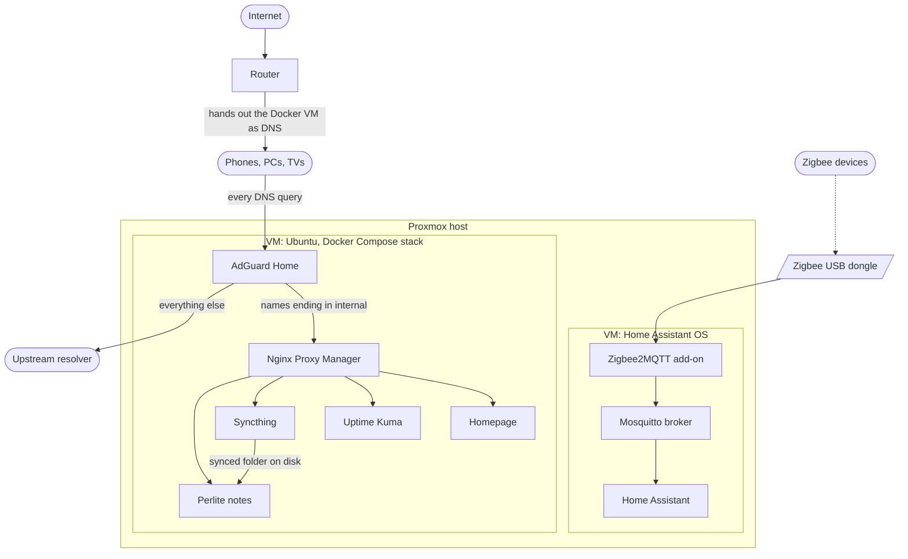
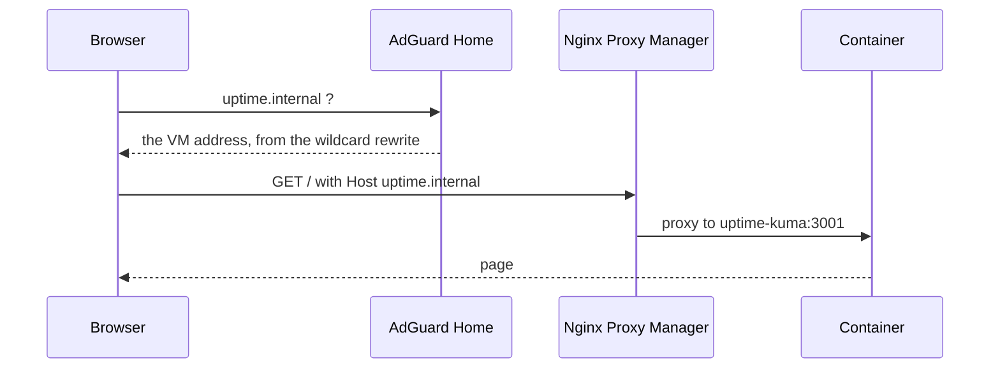

# Home Lab Stack

> A Proxmox host running two virtual machines: Home Assistant for the smart home, and Ubuntu with a Docker Compose stack for network services. Everything is reachable by private `.internal` names. Nothing is exposed to the internet.

---

### What this is

A template for a small always-on server. A mini PC runs Proxmox. One virtual machine runs Home Assistant OS with a Zigbee dongle passed through to it. A second runs Ubuntu Server with Docker, where one Compose file brings up six services. AdGuard Home answers DNS for the whole network, Nginx Proxy Manager turns `something.internal` into the right container, and the rest are the services you actually use.

Instructions are written against placeholders in angle brackets so they stay reusable. Fill in your own addresses.

| Placeholder | Meaning |
|---|---|
| `<router>` | Your router, which hands out addresses and DNS on the LAN |
| `<proxmox-host>` | The Proxmox machine, reached on port 8006 |
| `<ha-vm-ip>` | The Home Assistant virtual machine |
| `<docker-vm-ip>` | The Ubuntu virtual machine running the Compose stack |
| `<user>` | The login you create during the Ubuntu install |
| `<vmid>` | A virtual machine's number in Proxmox |

Concrete example, the lab these documents were written from:

```text
<router>         192.168.1.1
<proxmox-host>   192.168.1.10
<ha-vm-ip>       192.168.1.11
<docker-vm-ip>   192.168.1.12
```

---

### Architecture



---

### Services

| Service | Internal name | Host port | Container port | What it does |
|---|---|---|---|---|
| AdGuard Home | `adguard.internal` | 7777 | 7777 | Network wide DNS with ad and tracker blocking, plus the `.internal` rewrites |
| Nginx Proxy Manager | `nginx-proxmox.internal` | 81 | 81 | Reverse proxy, maps each internal name to a container |
| Homepage | `dashboard-proxmox.internal` | 7778 | 3000 | Dashboard linking to everything else |
| Uptime Kuma | `uptime.internal` | 7779 | 3001 | Polls the other services and alerts when one dies |
| Syncthing | `syncthing.internal` | 7780 | 8384 | File sync between machines |
| Perlite | `notes.internal` | 7781 | 80 | Renders the synced notes folder as a read only website |
| Redis | none, TCP only | 6379 | 6379 | In-memory cache, unauthenticated and with no data volume, used by AscendWebSearch below |
| AscendWebSearch | `ascend-scrapper.internal` | 7021 | 7021 | Web search and scraping API, a separate Compose project joined to this one only through the shared proxy network |

Nginx Proxy Manager also binds 80 and 443 for proxied traffic, AdGuard binds 53 for plain DNS plus 853 and 784 for the encrypted variants, and Syncthing binds 22000 and 21027 for its own peer protocol.

Perlite is two containers rather than one. The engine renders the markdown and has no published port, and `perlite-web` is the nginx that serves it. Setting it up takes a few extra steps, so it has its own page: [perlite_notes.md](perlite_notes.md).

Redis has no proxy entry because it speaks its own wire protocol, not HTTP, so Nginx Proxy Manager has nothing to forward. AscendWebSearch lives in its own directory with its own Compose file rather than in `compose.yaml`, since it is a different project with a different lifecycle. Both are covered together in [ascend_web_search.md](ascend_web_search.md).

Proxmox is not a container and is not in the Compose file, so its proxy entry points at an address rather than a container name. [nginx_proxy_manager.md](nginx_proxy_manager.md) covers that case. Home Assistant is reached directly on `<ha-vm-ip>:8123`, since it is the one service you open constantly from phones that already have it bookmarked.

---

### Quick start

The Proxmox host has to exist first, then the virtual machine. Follow [proxmox_host_install.md](proxmox_host_install.md), then [proxmox_docker_vm.md](proxmox_docker_vm.md), then come back here.

Clone this repository onto the virtual machine:

```bash
sudo git clone https://github.com/Lukk17/InstallationHelper.git /opt/docker-stack/InstallationHelper
```

Move into the stack directory:

```bash
cd /opt/docker-stack/InstallationHelper/homelab
```

Start everything:

```bash
docker compose up -d
```

Then configure the two services that need it: [adguard_dns.md](adguard_dns.md) first, because AdGuard owns the `.internal` names, and [nginx_proxy_manager.md](nginx_proxy_manager.md) second.

---

### Configuration

Four values in the Compose file are host specific. None of them is a secret, so they sit in the file directly.

| Setting | Default here | Why you might change it |
|---|---|---|
| `HOMEPAGE_ALLOWED_HOSTS` | `dashboard-proxmox.internal` | Homepage rejects any hostname missing from this list. Add `<docker-vm-ip>:7778` if you also open it by address |
| `PUID` | `1000` | User ID that owns the Syncthing files on the host |
| `PGID` | `1000` | Group ID for the same |
| `TZ` | `Europe/Warsaw` | Timezone inside the Syncthing container |

The stack carries no passwords or tokens. Every service sets its own credentials on first run and stores them under `/opt/docker-stack/`, which never enters version control.

The `proxy-tier` network in `compose.yaml` carries an explicit `name: proxy-tier` rather than letting Docker derive one from the directory, so that the separate AscendWebSearch Compose project can join it reliably. Applying that on a stack that is already running takes `docker compose down` followed by `docker compose up -d`, which recreates every container here. No data is lost, since every service in this file keeps its state on the bind mounts under `/opt/docker-stack/` listed below, not inside the container. Details on what joins that network and why are in [ascend_web_search.md](ascend_web_search.md).

Persistent data lives under `/opt/docker-stack/`, one directory per service, bind mounted into the containers. The Compose file alone will not restore your setup, because AdGuard filters, proxy hosts, dashboard layout, uptime monitors and Syncthing keys all live in those directories.

Image tags are pinned to exact versions rather than `latest`. An unattended pull with floating tags can hand you a breaking major release on a random Tuesday. Bump a tag deliberately, one service at a time.

---

### How a request travels



An ad domain ends earlier. AdGuard answers `0.0.0.0` and the browser has nowhere to connect.

---

### Troubleshooting

The whole network loses DNS. The AdGuard container is down, or something else grabbed port 53 on the virtual machine. Check `docker ps` and see [adguard_dns.md](adguard_dns.md) for the port 53 conflict.

Internal names fail but the internet works. The router is handing out a public DNS server, or the wildcard rewrite is missing in AdGuard.

One internal name returns 502. That container is stopped, or the port in its proxy host entry is wrong. The forward port is the container port, not the published host port.

Homepage answers "Host validation failed". The hostname is not in `HOMEPAGE_ALLOWED_HOSTS`. Add it in `compose.yaml` and recreate the container, as covered in [homepage_dashboard.md](homepage_dashboard.md).

Syncthing cannot write its files. The host directories under `/opt/docker-stack/syncthing/` are not owned by the `PUID` and `PGID` you set. See [syncthing.md](syncthing.md).

The notes site is empty. The Syncthing folder path is not `/data/notes`. See [perlite_notes.md](perlite_notes.md).

Zigbee devices went offline. The USB dongle is not attached to the Home Assistant machine, or the Zigbee2MQTT add-on stopped. See [home_assistant_vm.md](home_assistant_vm.md).

---

### Docs map

| Doc | What's in it |
|---|---|
| [proxmox_host_install.md](proxmox_host_install.md) | Installing Proxmox on the mini PC, updating it, node shell, backup retention |
| [proxmox_docker_vm.md](proxmox_docker_vm.md) | Creating the Ubuntu VM, installing Docker Engine, freeing port 53 |
| [home_assistant_vm.md](home_assistant_vm.md) | Building the Home Assistant OS VM with `qm`, and Zigbee USB passthrough |
| [home_assistant_backup.md](home_assistant_backup.md) | Home Assistant's own backups, the encryption key, and restoring |
| [adguard_dns.md](adguard_dns.md) | AdGuard first run, the `.internal` wildcard rewrite, blocklists, router DNS cutover |
| [nginx_proxy_manager.md](nginx_proxy_manager.md) | Adding the proxy host entries and verifying them |
| [syncthing.md](syncthing.md) | Pairing devices, folder paths, ownership, versioning |
| [perlite_notes.md](perlite_notes.md) | Publishing the synced notes folder as a website |
| [homepage_dashboard.md](homepage_dashboard.md) | Dashboard tiles, allowed hosts, and why the status check bypasses DNS |
| [uptime_kuma.md](uptime_kuma.md) | Monitors, why Proxmox is a ping, why AdGuard gets two checks |
| [ascend_web_search.md](ascend_web_search.md) | AscendWebSearch: containers, secrets, joining the proxy network, the ngrok exposure |
| [backup_restore.md](backup_restore.md) | Backing up the VMs and the service data, and restoring both |
