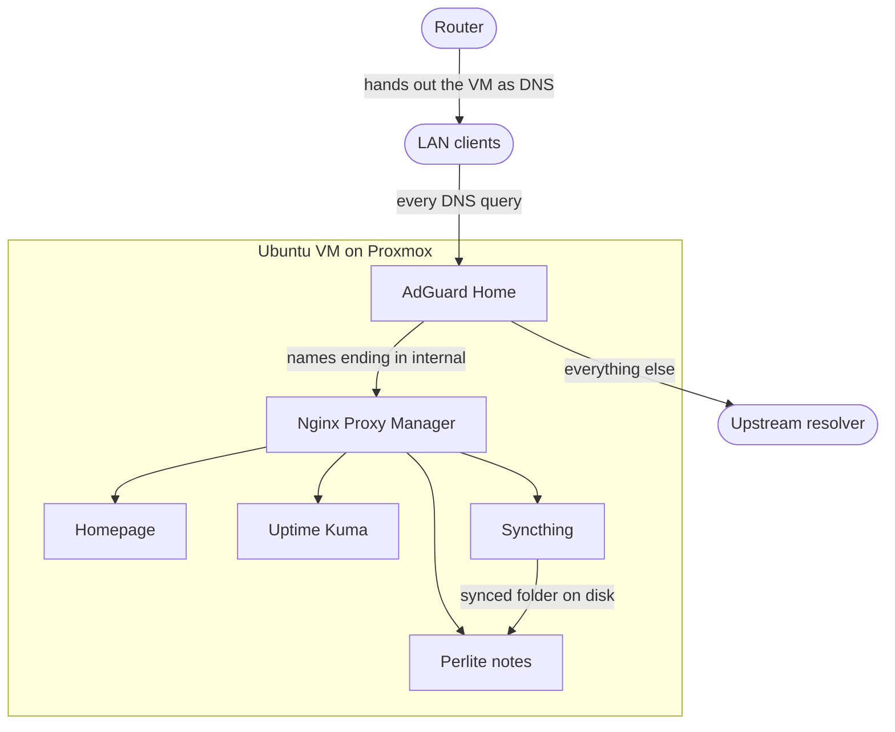
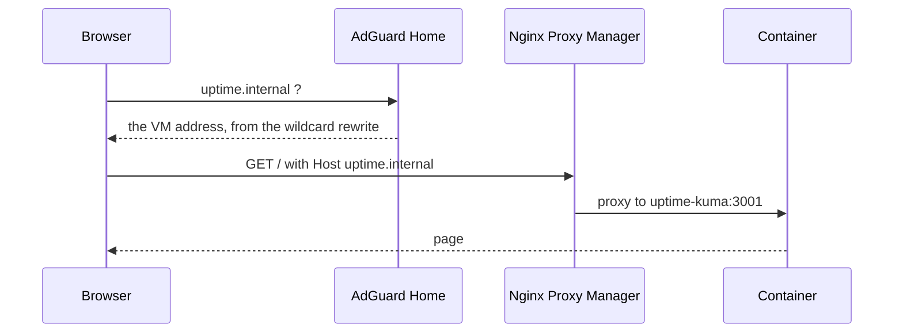

# Home Lab Stack

> Five self-hosted services on a Proxmox virtual machine, reachable by private `.internal` names through AdGuard Home
> and Nginx Proxy Manager. Nothing is exposed to the internet.

---

### What this is

A template for a small always-on server. A mini PC runs Proxmox, one virtual machine runs Ubuntu Server with Docker,
and one Compose file runs the services. AdGuard Home answers DNS for the whole network, Nginx Proxy Manager turns
`something.internal` into the right container, and the rest are the services you actually use.

Everything here is generic. Fill in your own addresses where the documents show a placeholder in angle brackets.

---

### Architecture



---

### Services

| Service | Internal name | Host port | Container port | What it does |
|---|---|---|---|---|
| AdGuard Home | `adguard.internal` | 7777 | 7777 | Network wide DNS with ad and tracker blocking, plus the `.internal` rewrites |
| Nginx Proxy Manager | `npm.internal` | 81 | 81 | Reverse proxy, maps each internal name to a container |
| Homepage | `dashboard.internal` | 7778 | 3000 | Dashboard linking to everything else |
| Uptime Kuma | `uptime.internal` | 7779 | 3001 | Polls the other services and alerts when one dies |
| Syncthing | `syncthing.internal` | 7780 | 8384 | File sync between machines |
| Perlite | `notes.internal` | 7781 | 80 | Renders the synced notes folder as a read only website |

Nginx Proxy Manager also binds 80 and 443 for proxied traffic, AdGuard binds 53 for DNS, and Syncthing binds 22000
and 21027 for its own peer protocol.

Perlite is two containers rather than one. The engine renders the markdown and has no published port, and
`perlite-web` is the nginx that serves it. Setting it up takes a few extra steps, so it has its own page:
[PERLITE_NOTES.md](PERLITE_NOTES.md).

---

### Quick start

The virtual machine has to exist first. Follow [PROXMOX_DOCKER_VM.md](PROXMOX_DOCKER_VM.md), then come back here.

Clone this repository onto the VM:

```bash
sudo git clone https://github.com/Lukk17/InstallationHelper.git /opt/docker-stack/InstallationHelper
```

Move into the stack directory:

```bash
cd /opt/docker-stack/InstallationHelper/homelab
```

Start everything:

```bash
docker compose up -d
```

Then configure the two services that need it: [ADGUARD_DNS.md](ADGUARD_DNS.md) first, because AdGuard owns the
`.internal` names, and [NGINX_PROXY_MANAGER.md](NGINX_PROXY_MANAGER.md) second.

---

### Configuration

Four values in the Compose file are host specific. None of them is a secret, so they sit in the file directly.

| Setting | Default here | Why you might change it |
|---|---|---|
| `HOMEPAGE_ALLOWED_HOSTS` | `dashboard.internal` | Homepage rejects any hostname missing from this list. Add `<docker-vm-ip>:7778` if you also open it by address |
| `PUID` | `1000` | User ID that owns the Syncthing files on the host |
| `PGID` | `1000` | Group ID for the same |
| `TZ` | `Europe/Warsaw` | Timezone inside the Syncthing container |

The stack carries no passwords or tokens. Every service sets its own credentials on first run and stores them under
`/opt/docker-stack/`, which never enters version control.

Persistent data lives under `/opt/docker-stack/`, one directory per service, bind mounted into the containers. The
Compose file alone will not restore your setup, because AdGuard filters, proxy hosts, dashboard layout and Syncthing
keys all live in those directories.

Image tags are pinned to exact versions rather than `latest`. An unattended pull with floating tags can hand you a
breaking major release on a random Tuesday. Bump a tag deliberately, one service at a time.

---

### How a request travels



An ad domain ends earlier. AdGuard answers `0.0.0.0` and the browser has nowhere to connect.

---

### Troubleshooting

The whole network loses DNS. The AdGuard container is down, or something else grabbed port 53 on the VM. Check
`docker ps` and see [ADGUARD_DNS.md](ADGUARD_DNS.md) for the port 53 conflict.

Internal names fail but the internet works. The router is handing out a public DNS server, or the wildcard rewrite is
missing in AdGuard.

One internal name returns 502. That container is stopped, or the port in its proxy host entry is wrong.

Homepage answers "Host validation failed". The hostname is not in `HOMEPAGE_ALLOWED_HOSTS`. Add it in
`compose.yaml` and recreate the container.

Syncthing cannot write its files. The host directories under `/opt/docker-stack/syncthing/` are not owned by the
`PUID` and `PGID` you set.

---

### Docs map

| Doc | What's in it |
|---|---|
| [PROXMOX_DOCKER_VM.md](PROXMOX_DOCKER_VM.md) | Creating the Ubuntu VM on Proxmox, installing Docker, freeing port 53 |
| [ADGUARD_DNS.md](ADGUARD_DNS.md) | AdGuard first run, the `.internal` wildcard rewrite, pointing the router at it |
| [NGINX_PROXY_MANAGER.md](NGINX_PROXY_MANAGER.md) | Adding the proxy host entries and verifying them |
| [PERLITE_NOTES.md](PERLITE_NOTES.md) | Publishing the synced notes folder as a website, and pairing Syncthing |
| [BACKUP_RESTORE.md](BACKUP_RESTORE.md) | Backing up the VM and the service data, and restoring both |
