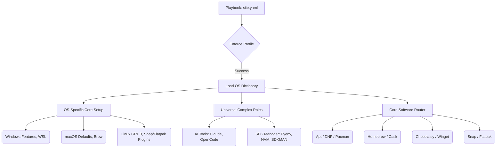

# Setup (Unified Cross-Platform Ansible Migration)

This project has been fully migrated from monolithic bash/powershell scripts to a highly modular, data-driven, cross-platform Ansible setup. It supports **Ubuntu/Debian**, **Fedora**, **Archlinux**, **Windows**, and **macOS** out of the box.

---

## 🏗 Architecture Overview

The architecture relies on a **Single Source of Truth** via Data-Driven Ansible.
The logic is driven by a master configuration file where you toggle specific installations and configurations on or off, and OS Dictionaries handle the underlying translation.



---

## 📂 Directory Structure & File Roles

* **`ansible/site.yaml` (The Playbook):** This is the main entry point for Ansible.
* **`ansible/group_vars/all.yaml` (Global Intent):** This file acts as your central configuration hub for cross-platform apps.
* **`ansible/group_vars/{linux,windows,macos}.yaml` (OS Toggles):** Booleans for apps/settings that only exist on that specific OS.
* **`ansible/vars/{Debian,RedHat,Archlinux,Windows,Darwin}.yaml` (Translation Dictionaries):** Maps the generic app name to the exact package name for each OS.
* **`ansible/profiles/`:** This directory contains specific override profiles (e.g., `linux_live.yaml`) which selectively toggle flags for non-standard setups. For a full default installation, no profile is needed.

---

## 📦 Package Manager Priorities

We strictly follow this explicit hierarchy per OS defined in the `vars/` dictionaries:

* **Windows:** Official/Vendor Installer > Chocolatey > Winget (UWP/Store apps).
* **macOS:** Official DMG/PKG > Homebrew (Cask for GUI, Formula for CLI) > Mac App Store (`mas`). *(GUI apps default to Casks).*
* **Linux (Ubuntu/Debian):** Official APT Repo > Flatpak > Snap > Default APT.
* **Linux (Fedora):** Official DNF Repo > Flatpak > Snap > Default DNF.
* **Linux (Arch/Manjaro):** Official Pacman > AUR Helper (`yay`) > Flatpak > Snap.

---

## 🚀 Universal Ansible Commands

### 1. Install Ansible
First, ensure Ansible is installed on your system.

**Ubuntu/Debian:**
```bash
sudo apt update
sudo apt install software-properties-common -y
sudo add-apt-repository --yes --update ppa:ansible/ansible
sudo apt install ansible -y
```

**Fedora:**
```bash
sudo dnf install ansible -y
```

**Archlinux:**
```bash
sudo pacman -S ansible --noconfirm
```

**macOS:**
```bash
brew install ansible
```

**Windows:**
You must run Ansible from within WSL (Windows Subsystem for Linux).
1. Install WSL via PowerShell: `wsl --install`
2. Open Ubuntu in WSL and install Ansible via the Ubuntu/Debian instructions above.
3. Configure WinRM on Windows to allow Ansible to connect from WSL.

### 2. Configure Your Setup
Review `setup/ansible/group_vars/all.yaml` (and the OS-specific files) and set the flags for the tools and settings you wish to apply to your machine. 
If you have a specific setup profile, you can override the variables by pointing to it during execution.

### 3. Run the Playbook
Run the playbook against your local machine. The `-K` flag ensures Ansible can prompt for the sudo password used for administrative tasks.

First, navigate to the ansible directory:
```bash
cd setup/ansible
```

Then, run the command for the profile you wish to use. The `-K` flag will prompt for your `sudo` password.

### **Commands Per OS and Profile**

#### **Ubuntu / Debian**

*   **Full Installation (Default):**
    ```sh
    ansible-playbook site.yaml -i localhost, -c local -K
    ```
*   **Linux Live Profile (For USB Drives):**
    ```sh
    ansible-playbook site.yaml -i localhost, -c local -e "@profiles/linux_live.yaml" -K
    ```

#### **Fedora**

*   **Full Installation (Default):**
    ```sh
    ansible-playbook site.yaml -i localhost, -c local -K
    ```
*   **Linux Live Profile (For USB Drives):**
    ```sh
    ansible-playbook site.yaml -i localhost, -c local -e "@profiles/linux_live.yaml" -K
    ```

#### **Arch Linux**

*   **Full Installation (Default):**
    ```sh
    ansible-playbook site.yaml -i localhost, -c local -K
    ```
*   **Linux Live Profile (For USB Drives):**
    ```sh
    ansible-playbook site.yaml -i localhost, -c local -e "@profiles/linux_live.yaml" -K
    ```

#### **macOS**

*   **Full Installation (Default):**
    ```sh
    ansible-playbook site.yaml -i localhost, -c local -K
    ```
    *(Note: The `linux_live` profile is not applicable to macOS).*

#### **Windows (via WSL)**

*   **Full Installation (Default):**
    ```sh
    ansible-playbook site.yaml -i localhost, -c local -K
    ```
    *(Note: The `linux_live` profile is not applicable to Windows).*

---

## 🖥 Desktop Environments (Linux)

You have granular control over installing vs configuring desktop environments.

In `ansible/group_vars/linux.yaml`, set:
* `install_kde_plasma: true` to physically install KDE via your package manager.
* `configure_kde_plasma: true` to apply themes, widgets, and shortcuts (useful if KDE is already installed, like on Fedora KDE Spin).

### Konsave Profile Management (KDE)
To save your current KDE Plasma configuration:
```bash
konsave -s lukk_desktop_profile
```

To export the saved profile to a file (`lukk_desktop_profile.knsv`):
```bash
konsave -e lukk_desktop_profile
```
**Important:** If you are re-exporting to an existing file, you must use the force (`-f`) flag, or it will not be overwritten:
```bash
konsave -e lukk_desktop_profile -f
```

To import and apply a profile from a file:
```bash
konsave -i config/lukk_desktop_profile.knsv
konsave -a lukk_desktop_profile
```

---

## 🛠 Complex Roles

Certain software installations cannot be abstracted by package managers and have dedicated roles:
* **`ai_tools`**: Installs NPM/Go binaries (Claude Code, OpenCode, Cowork Service).
* **`sdk_manager`**: Installs Pyenv, NVM, SDKMAN, FVM.
* **`linux_crypto_hardware`**: Installs udev rules for Trezor/Ledger.
* **`waydroid`**: Configures kernel parameters and custom GDM files for Wayland container execution.
